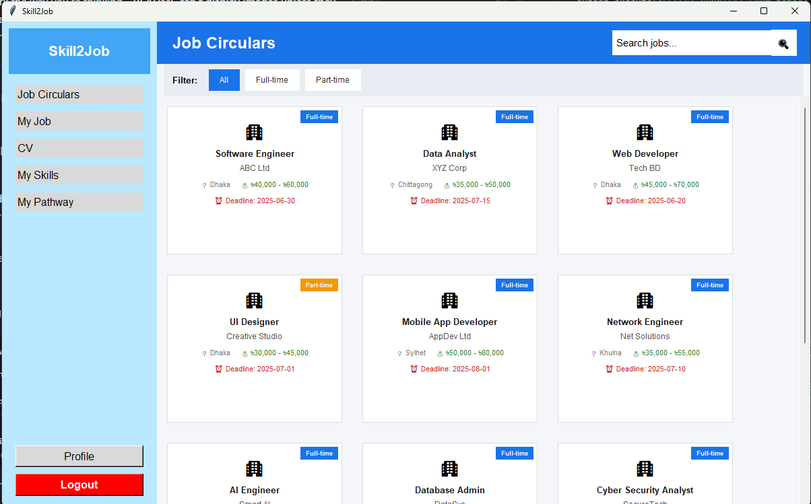

# 🚀 Skill2Job

Skill2Job is a desktop-based desktop application that helps users manage their skills and (in future) receive job recommendations based on those skills.

---

## ✨ Features

- 🧠 Add / Remove Skills  
- 📋 View Current Skills  
- 🚫 Duplicate Skill Prevention  
- 📊 Dashboard (All Jobs UI Ready)  
- 👤 Profile Management  
- 💾 JSON-based Storage  
- 🖥️ Tkinter GUI  

---

## 🧠 Core Idea

User → Add Skills → Store in JSON → (Future) Job Matching

---

## 🛠️ Tech Stack

- Python  
- Tkinter  
- JSON  

```
## 📂 Project Structure

Skill2Job/
│
├── main.py
├── data/
├── screens/
├── core/
├── api/
└── ui/
```

## ⚙️ Run Project

python main.py


## 📸 Screenshots

### 📊 Dashboard



## 🔥 Future Features

- Job Matching Algorithm  
- Skill Match Percentage  
- Skill Gap Analysis  
- Job Recommendation System  


## 🤝 Contribution

Pull requests are welcome.


## 📄 License

Free to use.


## 👨‍💻 Author
```
Md Jakaria Khalasi
Nazmul Hasan
Md Taslimul Hasan
Sourav Chandra Das
```

